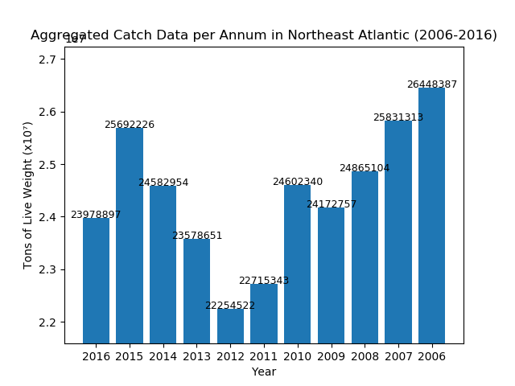

  ## European Fisheries Data Analysis Program -- 2006 - 2016

  Through the utilization of this program, in-depth analysis of the status of the fishery stocks in the Northeast Altantic can be deduced.
  
  This data has been submitted by ICES - The International Council for the Exploration of the Sea - a coalition of 20 participating European countries. 

  This project is built on the programming language, Python, in collaboration with pandas DataFrames, numpy, tabulate, and matplot primarily.

  As a note of importance, entries have been filtered out from the original data set because many contain zero entries. As a result, the original 52,517 entries have been reduced down to 7,343. This large reduction in entries is quite possibly due to a rarity/scarcity of some species in some waters.

  Interaction with the program is done through the python terminal. An interactive menu will prompt you to choose a function and once completed, you can begin to run another. 

  If an incorrect input is received -- ie. invalid -- the user will be prompted of where the error occurred and the program will exit immediately. 
  
  Users have access to a number of functions that can perform analysis on the data set.

  Users can analyze the total number of Species being recorded across the entire data set (or a subset if you wish).
  
  Users can determine the total annual catch for a year. The user will be prompted to choose a particular year to analyze.

  Users can determine the aggregate catch for a range of years. The user will be prompted to choose a particular year to analyze.

  Users can perform quantitative analysis to determine the health of fishery stocks. Using a TAC value of 0.80, each non-zero record's depleted status is analyzed and a proportion of depleted fishery catch data entries are measured and outputed.

  Users can perform quantitative analysis of the health of a specific fish species given the species' abbreviation upon the user's choosing.

  Users can perform quantitative analysis of the health in a specific area code in the Northeast Atlantic upon the user's choosing to determine how overfished each area can potential be.

  Users can display a bar graph of each years annual TLW from 2006 to 2016 of the entire Dataset.

  ## Report Conclusions
  Through analysis with the help of python, it was determined that there are 3487 entries that are classified as depleted and another 3856 entries that are not out of the 7,343 examined. This evaluates to a percentage of 47.49% based on a TAC value of 0.80 - Total Allowable Catch - to maintain sustainability.

  Bear in mind that this does NOT include other nations that may or may not be fishing in these waters as well -- this ONLY utilizes ICES data compiled from 20 participating European countries. 

  This also does not take into account other sources of environmental degradation that pose varying levels of stress to the marine environment like trawling, microplastics, oil, and chemical contamination including but not limited to carbon dioxide (CO2), volatile organic compounds (VOCs), chlorofluorocarbons (CFCs), and heavy metals like lead (Pb) and mercury (Hg).

  

  This is a Bar Graph generated via matplotlib function #7, using a small subset of the data entries (6).

  

  This is a Bar Graph generated via matplotlib function #7 using all of the 7343 entries containing non-zero values.

  Pip Modules used:

    * Matplotlib
    * Math
    * Numpy
    * Pandas
    * Pipenv
    * Pylint
    * Tabulate

