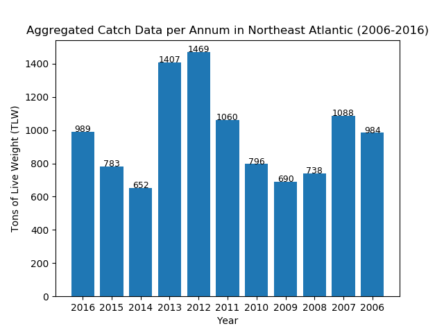
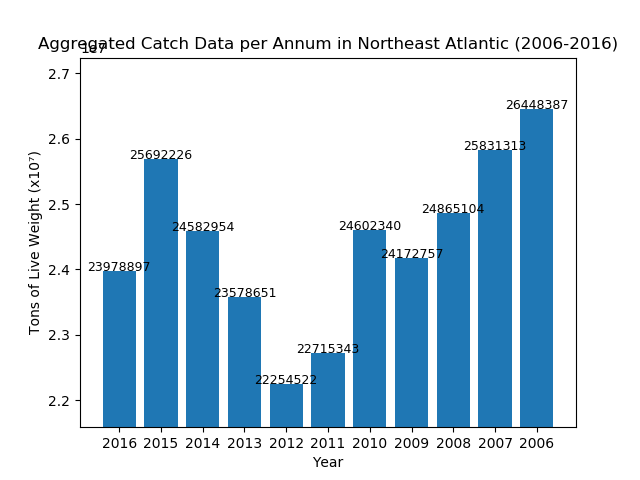

  ## European Fisheries Data Analysis Program -- 2006 - 2016

  Through the utilization of this program, in-depth analysis of the status of the fishery stocks in the Northeast Altantic can be deduced.
  
  This data has been submitted by ICES - The International Council for the Exploration of the Sea - a coalition of 20 participating European countries. 
  
  As a user...

  Users can query the open-source database and search a food item. Upon clicking on the listing,ingredients will be shown and a warning will be shown that contains possible allergens in that food item.

  Users can also post comments in each listing to add information like other possible allergens that could comtaminate the food item.

  Users can enter in a zipcode to search for nearby pharmacies if they find a possible allergen in the food item that they search that they are allergic to. Markers will be rendered and it will show an information window that shows the address and name of the marker.

  Users can also sign up to post a new listing to the database by registering. Posting to the database is a protected endpoint as is updating and deleting, which have yet to be implemented but is seen to be used by admins in the future. 

  

  This is a Bar Graph generated via matplotlib function #7, using a small subset of the data entries (6).

  

  This is a Bar Graph generated via matplotlib function #7 using all of the 7343 entries containing non-zero values.

  React and Redux are used on the front-end (with Create React-App and Buildpack for Heroku).
  NodeJS and as well as Mongoose and Express are used on the back-end with MongoDB as the database storage. 

  Pip Modules used:

    * Matplotlib
    * Math
    * Numpy
    * Pandas
    * Pipenv
    * Pylint
    * Tabulate

